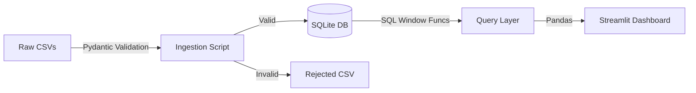

# Summit County Housing: Analytics Portfolio


A production-grade analytics dashboard demonstrating **Advanced SQL** capabilities and **Robust Data Engineering** practices.

This project ingests raw property records (~40k rows), validates the data using **Pydantic**, builds a normalized SQLite database, and visualizes market trends using **Streamlit**.

## 🚀 Key Technical Features

### 1. Advanced SQL Analytics
Instead of pre-calculating metrics in Python, this project pushes logic to the database layer to demonstrate SQL mastery:
- **Window Functions**: Uses `LAG()` to calculate property appreciation and holding periods between sales.
- **Moving Averages**: Uses `AVG() OVER (ORDER BY year ROWS BETWEEN 2 PRECEDING AND CURRENT ROW)` to smooth market volatility.
- **CTEs**: Unpivots denormalized CSV columns (`rec1`, `rec2`...) into a normalized transaction stream using `UNION ALL`.

### 2. Resilient Data Pipeline (The "DLQ" Pattern)
Real-world data is messy. The ingestion pipeline (`src/summit_housing/ingestion.py`) implements a **Dead Letter Queue** pattern:
- **Validation**: Every record is validated against strict **Pydantic** models.
- **Fail-Safe**: Records that fail validation (bad dates, text in numeric fields) do *not* crash the pipeline.
- **Audit**: Bad records are quarantined to `data/rejected_records.csv` for inspection.

### 3. Production Infrastructure
- **Dockerized**: Runs anywhere with a single command.
- **CI/CD Ready**: Includes `pytest` suite for queries and validators.
- **Strict Typing**: Codebase uses Python type hints throughout.

## 🛠️ Quick Start

### Option A: Docker (Recommended)
You don't need Python installed. Just Docker.

```bash
docker-compose up --build
```
*App will be available at http://localhost:8501*

### Option B: Local Dev
Requries Python 3.9+

```bash
# 1. Setup Environment
make setup

# 2. Run ETL Pipeline (Builds DB)
make ingest

# 3. Launch Dashboard
make run
```

## 🏗️ Architecture



## 📁 Project Structure

```text
summit_housing/
├── data/                 # Raw Input & DLQ Output
├── src/
│   ├── summit_housing/
│   │   ├── database.py   # Context Manager for SQLite
│   │   ├── measures.py   # Pydantic Schemas
│   │   ├── ingestion.py  # ETL Logic
│   │   ├── queries.py    # SQL Logic Repository
│   │   └── dashboard/    # UI Code
├── tests/                # Pytest Suite
├── Dockerfile            # Container Config
└── Makefile              # Task Automation
```

## 💡 Code Highlights

**The "Flipper" Query (Window Functions):**
```sql
SELECT 
    schno,
    estimated_price,
    -- Calculate Growth % from previous sale
    (estimated_price - LAG(estimated_price) OVER (PARTITION BY schno ORDER BY s.tx_date)) 
    / LAG(estimated_price) OVER (PARTITION BY schno ORDER BY s.tx_date) as appreciation
FROM sales_events
```

**The "Trend" Query (Moving Average):**
```sql
AVG(price) OVER (
    PARTITION BY city 
    ORDER BY year 
    ROWS BETWEEN 2 PRECEDING AND CURRENT ROW
)
```
